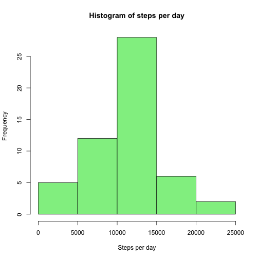
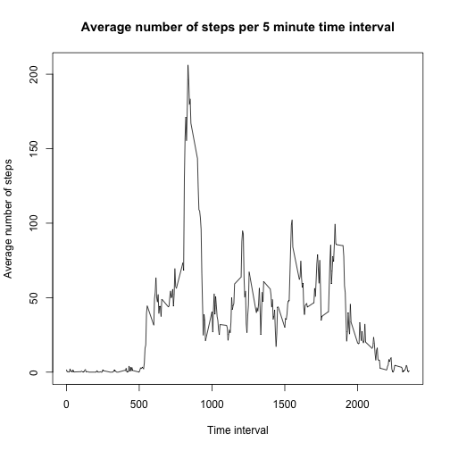
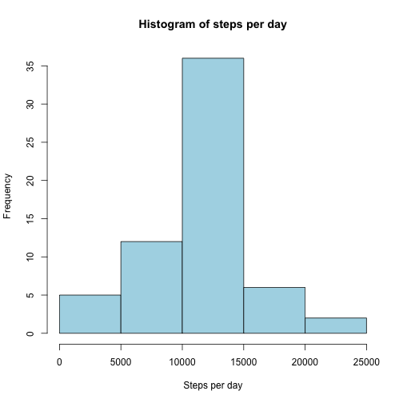
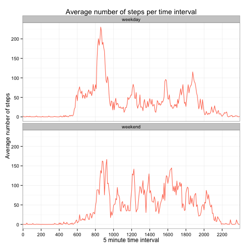

This r-program needs the package "timeDate"

This code chunk downloads the data (if neccessary) and reads the data.


```r
# set working directory 
setwd("~/Coursera/05_Reproducable_Research/Project1git")

# The following code checks if the right files are in your working directory
# If not, it downloads them and unzips them
# The file is: activity.csv
# The file can be downloaded from https://d396qusza40orc.cloudfront.net/repdata%2Fdata%2Factivity.zip

#---------------------------------------------------
# Verify input file exists.  If not, then get it.  
#---------------------------------------------------
sourcefile <- "https://d396qusza40orc.cloudfront.net/repdata%2Fdata%2Factivity.zip"
zipfile    <- "activity.zip"
csvfile    <- "activity.csv"
if(!file.exists(zipfile)) {download.file(sourcefile, zipfile, mode="wb", method="curl")}
if(!file.exists(csvfile)) {unzip(zipfile, csvfile)}  #unzip creates .csv file

#read datafile
activitiesraw<-read.csv(csvfile, sep=",", na.strings="NA")
activities<-activitiesraw[complete.cases(activitiesraw),]
```


What is mean total number of steps taken per day?


```r
# aggregate steps per day
StepsPerDay <-aggregate(steps ~ date, data = activities, FUN=sum)

# make histogram
hist(StepsPerDay$steps, xlab="Steps per day", main="Histogram of steps per day", col="lightgreen")
```

 

```r
# report mean
mean1<-format(mean(StepsPerDay$steps), digits=1, nsmall=1)

# report median
median1<-format(median(StepsPerDay$steps), digits=1, nsmall=1)
```

The mean for the steps per day is 10766.2   
The median for the steps per day is 10765


```r
# average steps per interval
StepsPerInterval <-aggregate(steps ~ interval, data = activities, FUN=mean)

# plot average steps per interval
plot(StepsPerInterval$interval, StepsPerInterval$steps, , type="l", main = "Average number of steps per 5 minute time interval", ylab="Average number of steps", xlab="Time interval") 
```

 

```r
# determine which interval has maximum average number of steps
max1<-StepsPerInterval[which.max(StepsPerInterval$steps),1]
max1hour <- floor(max1/100)
max1min <- max1-(max1hour*100)
```

The 5 minute interval that starts at 8:35 has the highest average number of steps 


```r
# calculate the number of missing values
missing<-sum(is.na(activitiesraw))
```

The number of missing values is 2304


```r
# Impute strategy: mean of 5 minute interval
missing<-sum(is.na(activitiesraw))

# merge mean of interval to raw data
colnames(StepsPerInterval)<-c("interval", "meansteps")
activitiesImp<-merge(activitiesraw,StepsPerInterval,by.x="interval", by.y="interval", all=FALSE)

# impute the missing values
activitiesImp$steps<-ifelse(is.na(activitiesImp$steps), activitiesImp$meansteps, activitiesImp$steps)

# aggregate steps per day
StepsPerDay2 <-aggregate(steps ~ date, data = activitiesImp, FUN=sum)

# make histogram
hist(StepsPerDay2$steps, xlab="Steps per day", main="Histogram of steps per day", col="lightblue")
```

 

```r
# report mean
mean2<-format(mean(StepsPerDay2$steps), digits=1, nsmall=1)

# report median
median2<-format(median(StepsPerDay2$steps), digits=1, nsmall=1)

# calculate differences
difmean <-format((mean(StepsPerDay$steps)-mean(StepsPerDay2$steps)), digits=1, nsmall=1)
difmedian <- format((median(StepsPerDay$steps)-median(StepsPerDay2$steps)), digits=1, nsmall=1)
```
The mean (with imputing missing values) for the steps per day is 10766.2   
The median (with imputing missing values) for the steps per day is 10766.2

The difference in the means is 0.0   
The difference in the medians is  -1.2

There is no impact of imputing missing data on the estimates of the total daily number of steps.   
However the mean and median are equal now.


```r
# calculate the day of the week
activitiesImp$weekday <- factor(weekdays(as.Date(activitiesImp$date, "%Y-%m-%d")), levels=c("Monday", "Tuesday", "Wednesday", "Thursday", "Friday", "Saturday", "Sunday"))

# make new factor for the weekend
activitiesImp$weekend<-activitiesImp$weekday
levels(activitiesImp$weekend)<-c("weekday", "weekday", "weekday", "weekday", "weekday", "weekend", "weekend")


# average steps per interval
StepsPerInterval2 <-aggregate(steps ~ weekend+interval, data = activitiesImp, FUN=mean)

# plot average steps per interval
library(ggplot2)
StepsPerInterval2$interval <- as.factor(StepsPerInterval2$interval)
g<-ggplot(StepsPerInterval2, aes(x = interval, y = steps, group = weekend)) +
geom_line(colour="coral1") + theme_bw() +
facet_wrap(~ weekend, ncol=1) +
scale_x_discrete(breaks = seq(0, 2400, by = 200)) + 
xlab("5 minute time interval") + 
ylab("Average number of steps") +
ggtitle("Average number of steps per time interval")
g 
```

 
